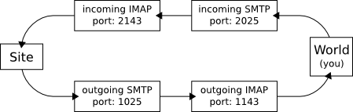

# Chcem vediet

Chcem vedieť -- Slovak for "I want to know" -- a server to ease access to information under the
[Slovak Freedom Of Information Act 211/2000 Coll](http://www.urzd.sk/legislativa/211-00-en.pdf).

## 1. Local Development Server

To develop and test the site locally on your computer you don't need any real webserver, database,
nor mail server. They are simulated by the testing environment.

Please make sure you won't push any autogenerated files to the git repository, such as your local
`env/` directory or `test.db` and `*.pyc` files.

### 1.1. Dependencies

You need the following packages installed:

 * python (ver. 2.7.x)
 * python-virtualenv
 * libmagic (ver. 5.25+, package `libmagic1`)
 * webp
 * libxml2-dev
 * libxslt-dev

The following packages are also recommended, but you can configure `setup.py` to use mocks
instead of them:

 * libreoffice (ver. 6.3.4+)
 * imagemagick
 * [abbyyocr11]

 [abbyyocr11]: https://www.ocr4linux.com/en:download:start

#### 1.1.1. ImageMagick Configuration

In the Imagemagick `policy.xml` file change the `rights` of `PDF` format type from `"none"`
to `"read|write"`. See the related [Imagemagick issue] why.

  <policy domain="coder" rights="read|write" pattern="PDF" />

[Imagemagick issue]: https://bugs.launchpad.net/ubuntu/+source/imagemagick/+bug/1796563

#### 1.1.2. Libmagic Configuration

Some word documents can sometimes fail to identify correctly. You can solve it by editing
`/etc/magic` file with add rules for this documents. See the related [Libmagic issue] why.

[Libmagic issue]: https://serverfault.com/questions/338087/making-libmagic-file-detect-docx-files/377792

### 1.2. Installation

To prepare your local development environment, run the following commands:

	$ git clone https://github.com/martinmacko47/chcemvediet.git
	$ cd chcemvediet
	$ python setup.py

The configuration script will ask you to input some options. Among other things it will ask you to
choose server mode. There are several server modes. Local development mode with no email
infrastructure and online development mode with no email infrastructure do not send any emails at
all. They just store them in the database. You can use admin interface to see emails sent from the
application and to manually mock replies to them. Local development mode with dummy email
infrastructure does not send real emails, it mocks local SMPT/IMAP servers, so you can use any
local SMTP/IMAP client to read emails sent by the application and send your replies back to the
application. Online development mode with working email infrastructure and dummy obligee email
addresses sends real emails using Mandrill service, however, obligee email addresses are replaced
with dummies, so you won't send any unsolicited emails to them. For details on the dummy e-mail
infrastructure see [Dummy e-mail infrastructure](#5-dummy-e-mail-infrastructure) section, and for
instructions how to setup Mandrill see [Mandrill transactional e-mail
servis](#4-mandrill-transactional-e-mail-servis) section below. For local development use one of
the local development modes.

The script will ask you for your OAuth Client IDs and Secrets for social account providers. See
[Social accounts application keys](#3-social-accounts-application-keys) section bellow for details
how to get social accounts application keys.

### 1.3. Updates

You should update your development environment regularly to reflect the changes made by other
developers. To update the environment, you can delete it and recreate it from the scratch again, or
you can migrate it. Migrations are useful if you've got some unfinished work you have not pushed to
the repository, yet. However, you should recreate your environment from the scratch once in
a while, as the migrations are not bulletproof and may fail sometimes, especially if migrating from
a rather old environment.

To migrate to an updated version of the site, run the following commands:

	$ git pull
	$ env/bin/python setup.py

If some migrations fail, try to run them once or twice again. Sometimes it helps.

### 1.4. Viewing the site

 1. Run testing webserver:

    	$ env/bin/python manage.py runserver

 2. Run testing cronserver in another shell:

    	$ env/bin/python manage.py cronserver

 3. Run dummy mail infrastructure in yet another shell if you have configured local development
    server mode with dummy email infrastructure (don't run this command if you have configured
    another server mode):

    	$ env/bin/python manage.py dummymail

 4. Now, you can navigate your browser to: http://127.0.0.1:8000/ and start using it.

### 1.5. Viewing the site using https

To run a server with https you can use
[RunServerPlus](https://django-extensions.readthedocs.org/en/latest/runserver_plus.html) from
[django-extensions](https://github.com/django-extensions/django-extensions). You need the
`libffi-dev` package installed in your system.

 1. Run the following commands:

    	$ env/bin/pip install django-extensions==1.0.3
    	$ env/bin/pip install Werkzeug==0.9
    	$ env/bin/pip install pyOpenSSL==0.13

 2. Add `django_extension` to `INSTALLED_APPS` in `chcemvediet/settings/server_local.py` file:

    	INSTALLED_APPS = (
    	    ...
    	    u'django_extensions',
    	    ...
    	    )

 3. Setup default protocol in `chcemvediet/settings/server_local.py`.

    	ACCOUNT_DEFAULT_HTTP_PROTOCOL = u'https'

 4. Run the server in ssl mode with:

    	env/bin/python manage.py runserver_plus --cert /tmp/cert

 5. Now, you can navigate your browser to: https://127.0.0.1:8000/ and start using it.

Or you can create a public https URL using [ngrok](https://ngrok.com/download).

## 2. Online Development and Production Servers

We run production server on Apache using `mod_wsgi` and MySQL database.

### 2.1. Dependencies

You need the following packages installed

 * apache2 (ver. 2.2.x)
 * mysql-server (ver. 5.5.5+)
 * python (ver. 2.7.x)
 * python-virtualenv
 * python-dev
 * libmysqlclient-dev
 * libapache2-mod-wsgi
 * libreoffice (ver. 6.3.4+, on Ubuntu, you might want to use `sudo add-apt-repository ppa:libreoffice/ppa`)
 * imagemagick
 * libmagic (ver. 5.25+, package `libmagic1`)
 * webp
 * [abbyyocr11]

 [abbyyocr11]: https://www.ocr4linux.com/en:download:start

#### 2.1.1. MySQL Configuration

Make sure your database has configured UTF-8 charset with correct collation:

	mysql> alter database {database} character set utf8 collate utf8_general_ci;

Where `{database}` is your database name. You must alter database charset before creating any
tables, otherwise they will keep the old charset.

#### 2.1.2. ImageMagick Configuration

In the Imagemagick `policy.xml` file change the `rights` of `PDF` format type from `"none"`
to `"read|write"`. See the related [Imagemagick issue] why.

	<policy domain="coder" rights="read|write" pattern="PDF" />

[Imagemagick issue]: https://bugs.launchpad.net/ubuntu/+source/imagemagick/+bug/1796563

#### 2.1.3. Libmagic Configuration

Some word documents can sometimes fail to identify correctly. You can solve it by editing
`/etc/magic` file with add rules for this documents. See the related [Libmagic issue] why.

[Libmagic issue]: https://serverfault.com/questions/338087/making-libmagic-file-detect-docx-files/377792

### 2.2. Installation

To prepare your server environment, run the following commands:

	$ git clone https://github.com/martinmacko47/chcemvediet.git
	$ cd chcemvediet
	$ python setup.py
	$ env/bin/python manage.py collectstatic --noinput

In the configuration script select one of the online development server modes or the production
server mode. Online development server modes have enabled some debug options that can be usefull
during pre-alpha testing. In addition to questions asked in local development mode, the script will
ask you to enter your database credentails.

### 2.3. Apache Configuration

Make sure `mod_wsgi` Apache module is installed and enabled and add the following directives to
your virtualhost configuration:

	ServerName {domain}
	ServerAlias www.{domain}

	...

	Alias /robots.txt {path}/chcemvediet/static/robots.txt
	Alias /favicon.ico {path}/chcemvediet/static/favicon.ico
	Alias /static/ {path}/chcemvediet/static/
	<Directory {path}/chcemvediet/static>
	  Require all granted
	  Options -Indexes
	</Directory>

	WSGIScriptAlias / {path}/chcemvediet/chcemvediet/wsgi.py
	WSGIDaemonProcess {domain} user={user} group={group} python-path={path}/chcemvediet:{path}/chcemvediet/env/lib/python2.7/site-packages
	WSGIProcessGroup {domain}
	<Directory {path}/chcemvediet/chcemvediet>
	  <Files wsgi.py>
	    Require all granted
	  </Files>
	</Directory>

Where `{path}` is an absolute path to the repository, `{domain}` is your web domain and `{user}`
and `{group}` are unix user and group names the server will run under.

### 2.4. Cron Configuration

Configure cron to run app cron tasks every minute. The app handles itself how often the tasks are
run and protects them from concurrent excecution in case some task takes longer then one minute to
complete. Add the following rule to your contab:

	* * * * * {user} cd {path}/chcemvediet && env/bin/python manage.py runcrons

Where `{path}` is an absolute path to the repository and `{user}` is the unix user name the server
will run under.

### 2.5. Reference dockerfile for testing

You can try to build production environment in Docker using this [Dockerfile]. However, don't use
it on production. It is here just for reference, how to build the environment. It comes with
disabled mail infrastructure, mocked OCR and self-signed ssl certificate on localhost domain.

Setup testing localhost domain in your `/etc/hosts`:

	127.0.0.1  chcemvediet.local
	127.0.0.1  www.chcemvediet.local

Copy [Dockerfile] into an empty directory and run the docker image as follows:

	$ docker build -t chcemvediet .
	$ docker run -it -p 80:80 -p 443:443 --name=chcemvediet chcemvediet

You can see the testing app built with production environment on URL https://www.chcemvediet.local/
on localhost. Note that it uses self-signed ssl certificate, so you must add an exception for it in
your browser.

[Dockerfile]: misc/Dockerfile

## 3. Social accounts application keys

### 3.1. Google OAuth

 1. Go to https://code.google.com/apis/console/ and create a project.

 2. Select the project, click on 'APIs & auth' / 'Credentials' and 'Create new Client ID' with the
    following options:

      * Application type: Web application
      * Authorized JavaScript origins: `http://{domain}/`
      * Authorized redirect URI:

        	http://{domain}/accounts/google/login/callback/
        	http://{domain}/sk/accounts/google/login/callback/
        	http://{domain}/en/accounts/google/login/callback/

    Where `{domain}` is your production domain or `127.0.0.1:8000` if in local development mode.

 3. Run the configuration script `setup.py` and enter given 'Client ID for web application' and
    'Client secret'.

### 3.2. Facebook OAuth

 1. Go to https://developers.facebook.com/apps/ and create an app.

 2. Add a Product 'Facebook Login' and select platform 'Web'. Enter 'Site URL' `https://{domain}/`.

 3. Go to 'Facebook Login' / 'Settings' and add 'Valid OAuth Redirect URIs':

    	https://{domain}/accounts/facebook/login/callback/
    	https://{domain}/sk/accounts/facebook/login/callback/
    	https://{domain}/en/accounts/facebook/login/callback/

    Where `{domain}` is your production domain or `127.0.0.1:8000` if in local development mode.
    'Site URL' in form `127.0.0.1:8000` is invalid use `localhost:8000` instead.

 5. Run the configuration script `setup.py` and enter given 'App ID' and 'App Secret'.

To use Facebook Login on localhost, you need to use [https connection](#15-viewing-the-site-using-https). 

## 4. Google custom search engine key

 1. Sign into [Control Panel](https://cse.google.com/create/new) using your Google Account.

 2. In the **Sites to search** section, add the `www.chcemvediet.sk` page. Set **Language** to
    `Slovak`and click **Create**. 

 3. Go to the **Look and feel** section and click the **Layout** tab. Select and save the `Results
    only` layout.

 4. Go back to **Setup** section. On the **Basics** tab, in the **Details** section, copy **Search
    engine ID**.

 5. Run `setup.py` to configure your google custom search API key.

## 5. Mandrill transactional e-mail servis

To use Mandrill, you need to register on their site http://mandrill.com/ and obtain a Mandrill API
key. The configuration script `setup.py` will ask for this key.

To let Mandrill process your inbound e-mails, you must configure your inbound e-mail addresses to
reside on domains you control. The configuration script will ask you to input your admin e-mail,
your default from e-mail and your inforequest unique email template. For every domain you use with
these addresses, you must add MX DNS records as required by Mandrill. For details see
https://mandrillapp.com/inbound. Note that obligee emails should not reside on domains you
configured to use with Mandrill.

To setup Mandrill webhook you need an URL Mandrill server can access. If you will be running your
server behing a firewall or NAT, you need to setup a tunelling reverse proxy to your localhost. See
https://ngrok.com/ for instance. The configuration script will ask for your webhook prefix. For
instance, if using ngrok, your prefix should look like `https://<yoursubdomain>.ngrok.com/`.
After you input the webhook prefix, the script will give you a full URL you are to use to configure
your Mandrill webhook. To configure the webhook, go to https://mandrillapp.com/inbound and add
a route pointing to this URL for every inbound domain. Note that in order to add a route your
server must be up and running, so for now skim the rest of the configuration script, run the
server, setup the route and run the configuration script once again to input remaining options.

After you have added your webhook, go to https://mandrillapp.com/settings/webhooks and add
a webhook to trigger on the following events: `send`, `deferral`, `hard_bounce`, `soft_bounce`,
`open`, `click`, `spam` and `reject`. Finally, copy the keys of all your webhooks and input them
into the configuration script and restart the server.

## 6. Dummy e-mail infrastructure

Using the command:

	$ env/bin/python manage.py dummymail

you can create a dummy e-mail infrastructure for local development. For help on command options
run:

	$ env/bin/python manage.py help dummymail

This command runs two pairs of dummy SMTP and IMAP servers on localhost. One pair is for outgoing
mails and one for incoming mails. By default, outgoing SMTP server runs on port number 1025,
incoming SMTP server on port number 2025, outgoing IMAP server on port number 1143 and incoming
IMAP server on port number 2143. You may change these port numbers with options.

  

During the development, you may use this infrastructure to simulate the site communication with the
outside world with no risk of sending any real e-mails to the outside world. In this setting, the
outside world will be represented by you, the site developer and/or tester. This means that all
e-mails sent from the site will be delivered to your IMAP client instead of their real destination.

The site sends its outgoing mails to the outgoing SMTP server and fetches its incoming mails from
the incoming IMAP server. On the other side, if you (representing the outside world) want to send
an email to the site, you have to send it to the incoming SMTP server. If you want to read the
mails sent by the site, you should fetch them from the outgoing IMAP server. Never try to connect
to outgoing SMTP server nor the incoming IMAP server. Only the site should connect to them. We run
two separate pairs of SMTP and IMAP servers in order to make sure the messages from the site will
not confuse with the messages from the outside world.

You may use any common IMAP e-mail client to connect to the incoming SMTP server and the outgoing
IMAP server. However, some e-mail clients (e.g. Thunderbird) get confused when the server
infrastructure restarts and refuse to fetch the messages any more. Restarting the client should
help. Sometimes, some clients (e.g. Thunderbird) refuse to fetch some messages for no apparent
reason, especially the first message. In such case, try some other client, or try to send the
message once again. The password for both the incoming SMTP server and the outgoing IMAP server is
`aaa`.

Note: No real e-mails are sent anywhere. The SMTP server is dummy and will never relay any received
message to any other SMTP server. Instead, it will store it locally in the memory and make it
available via dummy IMAP server. So, it's safe to send any message, from any e-mail address to any
e-mail address whatsoever. Nothing will be delivered. Also note, that all e-mails are stored in the
memory only, so they will disappear when the infrastructure is restarted.

## 7. Contributing

If you want to contribute, please, create a new branch for your changes:

	$ git checkout -b <new_branch_name>
	$ git commit
	$ git push -u origin <new_branch_name>

And then submit a 'Pull Request' on GitHub.

### 7.1. Site Content and translations

All site text content is stored in templates. Templates are in `template` directories all over the
project. Some templates are translated in place and have their translated versions such as
`about.sk.html` and `about.en.html`. Some templates are not translated in place and have only one
english version, e.g. `header-menu.html`. All translatable text from templates that are not
translated in place is exported into the localization `*.po` file stored in `locale` directory. As
a rule, templates with lots of text but no structrure are translated in place and templates with
lots of structure but short on text are translated via the localization file.

Templates with their own translated versions can be edited directly. Editing templates with no in
place translation is a bit more complicated. To change the translation of such template, open
localization file `locale/{sk,en}/LC_MESSAGES/django.po`, find the translations, edit them and
recompile them. To recompile translations rerun `setup.py`.

Localization files contain also translation strings defined in the code. If you add a new or remove
an existing translation string in the code, you need to reflect the change in the localization files
as well. You can do it manually or use the following command to scan the entire source tree of the
current directory and update the localization files for you:

	$ cd chcemvediet/chcemvediet
	$ ../env/bin/python ../manage.py makemessages -l sk -l en --no-wrap --no-location
